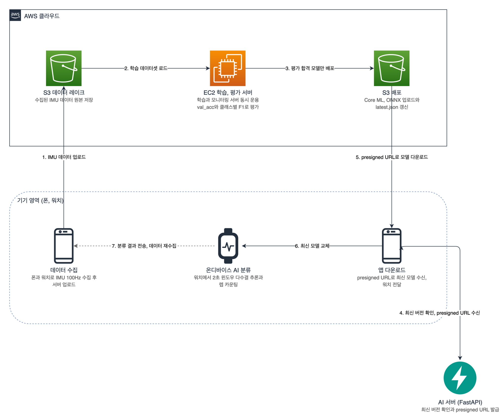
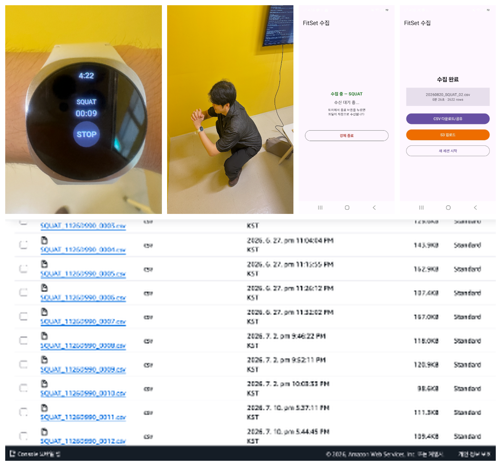
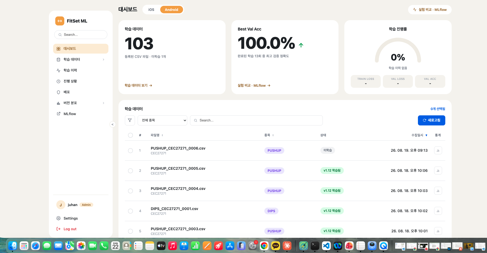
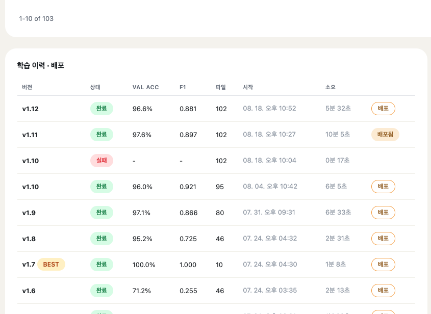

# FitSet ML Server

스마트워치 IMU 시계열로 운동 종목을 분류하는 온디바이스 모델의 데이터 수집, 학습, 평가, 변환, 배포 전 과정을 담당하는 ML 서버입니다.

## 클라우드 아키텍처

## 시스템 아키텍처

## 기술 스택

| 구분 | 기술 |
|------|------|
| 서버 | Python, FastAPI |
| ML | PyTorch, MLflow, Core ML, ONNX |
| LLM | AWS Bedrock, LangGraph |
| DB | MySQL(RDS), DynamoDB(NoSQL) |
| 인프라 | ECS(Fargate), EC2, ALB, Route 53, VPC, NAT Gateway, S3, CloudFront, CloudWatch, SSM |
| 배포 | Docker, ECR, GitHub Actions |

## 모델 배포 생애주기

## 데이터 실수집

## 모델 성능

| 측정 항목 | 수치 | 측정 항목 | 수치 | 측정 항목 | 수치 |
|------|------|------|------|------|------|
| val_accuracy | 0.9596 | f1_사레레 | 1.0000 | f1_벤치프레스 | 0.8889 |
| test_accuracy | 0.9293 | f1_휴식 | 0.9536 | f1_머신 플라이 | 0.8333 |
| f1_전체 | 0.9209 | f1_오버헤드 프레스 | 0.8750 | f1_힙쓰러스트 | 1.0000 |
| f1_스쿼트 | 1.0000 | f1_바벨로우 | 0.8571 | f1_시티드 로우 | 0.8000 |
| f1_푸시업 | 0.9333 | f1_데드리프트 | 0.9167 | f1_딥스 | 1.0000 |
| f1_덤벨컬 | 0.9600 | f1_랫풀다운 | 0.8750 | | |

## 대시보드

## 코드 아키텍처

| 경로 | 역할 |
|------|------|
| app/main.py | 앱 조립, 라우터 등록 |
| app/deps.py | 공통 의존성 주입 |
| app/core/ | 설정, 공통 스키마, S3 클라이언트 |
| app/data/ | 센서 데이터 수집 도메인 |
| app/training/ | 모델 학습, 이력 도메인 |
| app/deployment/ | 배포, 모델 서빙 도메인 |
| app/worker/ | 학습 프로세스 런타임 |
| app/worker/trainer.py | 학습 엔트리포인트 |
| app/worker/model_def.py | 모델 정의, 공개본은 스텁 |
| app/worker/preprocess.py | 전처리 |
| app/worker/convert.py | Core ML, ONNX 변환 |
| static/ | 관리 대시보드 |
| airflow/ | 재학습 파이프라인 |
| docs/ | 아키텍처, API 명세, ADR |
| tests/ | 단위, 통합 테스트 |

| 층 | 역할 |
|------|------|
| router | HTTP 라우팅, 형식 검증, 응답 직렬화 |
| service | 유스케이스 조율 |
| domain | 순수 업무 규칙 |
| repository | S3, MLflow 접근 |
| core | 공유 인프라 |

## 깃 컨벤션

| 항목 | 규칙 | 예시 |
|------|------|------|
| 커밋 메시지 | 타입(스코프): 요약 | fix(training): 업로드 미완료 파일 학습 제외 |
| 커밋 타입 | feat, fix, docs, test, refactor, ci, chore | |
| 브랜치 | 타입/케밥 케이스 | feat/per-file-time-split |
| 이슈 연결 | 제목 끝 (#이슈번호) | feat: MLflow UI 프록시 노출 (#33) |
| PR | 템플릿 작성, 요약, API 변경, 결정과 근거, 테스트 | |
| 머지 | main 머지 시 CD 자동 배포 | |
