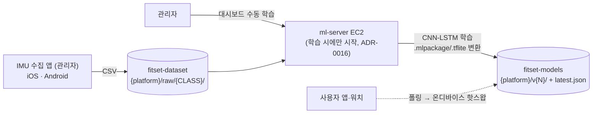
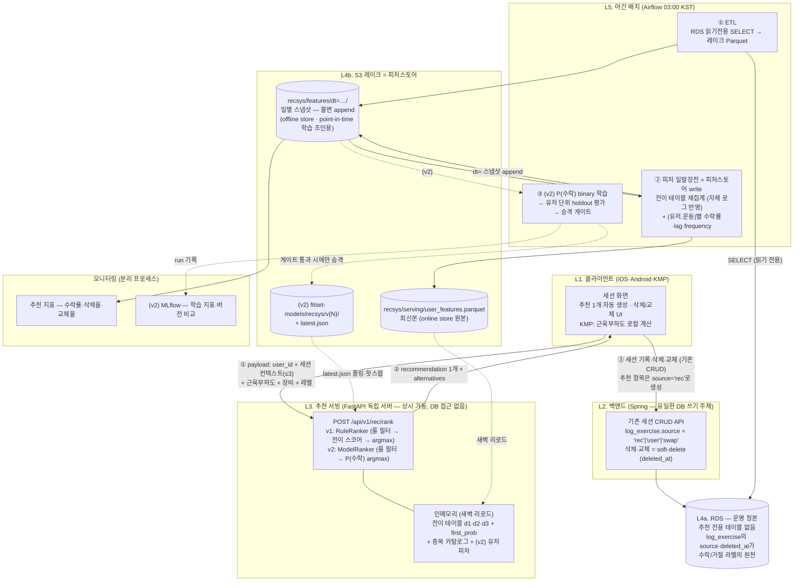
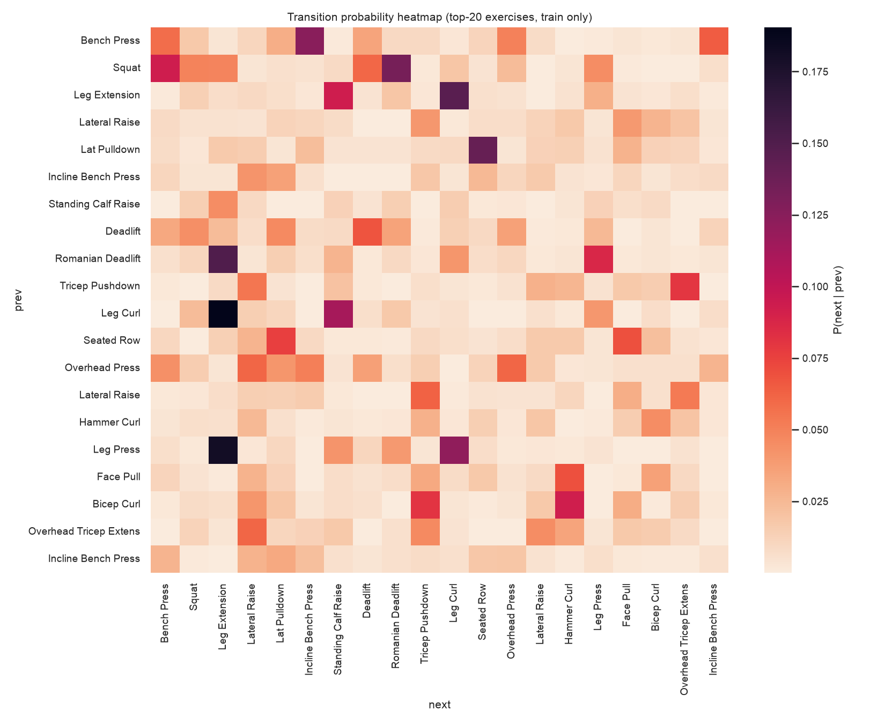

# ADR(제안): 운동 추천 v1 — 전이확률 후보 생성 + 룰베이스 제외

> 작성: 이주한 · 2026-07-04 · 상태: **제안(Proposed)**
> 상위 문서: `fitset-recsys-design.md`(추천 트랙 전체 설계) · 실험 코드: `~/fitset-recsys-data/experiment_surrogate_v2.py`

---

## 0. 한 줄 설명

**"600k 공개 프로그램 = 코치가 짠 좋은 운동 루틴"이라고 가정하고, 그 루틴들의 운동 순서(전이확률)로 다음 운동을 추천하되, 룰베이스 필터(장비·운동레벨·근육부하)로 사용자가 지금 할 수 없는 운동을 먼저 제외한 뒤 최고점 1개를 세션에 자동 생성한다.**

- 추천의 정답은 "무엇이 좋은 다음 운동인가"인데, 이를 직접 학습할 자체 로그가 아직 없다. 대신 검증된 루틴 데이터셋의 순서 통계를 정답 프록시로 쓴다.
- ML 모델(재정렬기)은 v1에서 배제한다. 전이 테이블 3개(딕셔너리 룩업)만으로 서빙하므로 모델 서빙 인프라·재학습 파이프라인 없이 시작하고, **추천 생성·수행·삭제 기록이 쌓이면 유저별 수락률과 lag(마지막 수행 후 경과일)를 피처로 추가해 LGBM 이진 분류 P(수락) 모델로 전환한다** (실험으로 상한선 확인 완료 §6, 전환 파이프라인 §7).

## 1. 시스템 아키텍처

전체 아키텍처·프로세스 구조는 **`fitset-recsys-design.md`를 그대로 따른다.** 이 ADR이 확정하는 것은 그 안의 **서빙 점수 로직**(1-3)이다.

### 1-1. 분류 트랙 (기존 — 참고용, 이번 작업에서 손대지 않음)



### 1-2. 추천 트랙 (신규 — 이 문서의 범위)

**설계 원칙 4가지:**
1. **쓰기는 Spring만** — DB 쓰기 주체는 백엔드 API 서버 하나. ML 쪽은 야간에 읽기 전용으로 긁어 데이터 레이크에 학습 형식(Parquet)으로 적재만 한다.
2. **피처 일발장전** — 야간 워커가 유저별 다음날 피처를 미리 구워 두고, 서빙은 새벽에 메모리로 로드. **낮 서빙의 DB 쿼리 = 0개.**
3. **오늘자 최신 정보는 클라가 들고 온다** — 방금 뭐 했는지(세션 컨텍스트)와 근육부하도는 요청 payload로 동봉. 일발장전 피처(어젯밤 기준) + payload(지금 기준)를 합쳐 최종 랭킹.
4. **대시보드·워커·서빙 프로세스 분리** — 학습 워커가 죽거나 바빠도 서빙·대시보드는 무관.



**흐름 요약**: 낮에는 ①②③만 돈다 — ③은 추천 전용 로그가 아니라 **기존 세션 CRUD**이고, 추천으로 생성된 항목이 `source='rec'`로 구분될 뿐이다(백엔드 추가 API 없음). 밤에는 ETL → 피처 일발장전(전이 테이블 재집계 + 유저 피처)이 돌고, v2부터 학습·승격 게이트가 그 뒤에 붙는다(점선). 새벽에 서빙이 새 피처(·새 모델)를 리로드한다. 야간 배치가 통째로 실패해도 낮 서빙은 **어제 피처+어제 모델로 계속 동작**한다(가용성 격리).

**피처스토어 규약**: `dt=` 일별 스냅샷은 **덮어쓰지 않고 append** — 학습 시 "추천일 전날 스냅샷"을 조인하면 point-in-time이 자동 보장되고(§7-2), 서빙이 본 값 = 학습이 본 값이라 학습-서빙 스큐가 구조적으로 없다. 별도 피처스토어 DB(Redis/Feast)는 두지 않는다 — 유저 피처 전체가 수십 MB라 인메모리로 충분(수십만 유저부터 재검토).

**분리의 실익**: 분류용 ML EC2는 ADR-0016대로 Stop/Start를 유지하고, 추천 트랙만 상시 가동 자리를 새로 정하면 된다. 두 트랙이 공유하는 건 MLflow와 S3 규약, latest.json 배포 패턴뿐이다. 점선 요소(③ 학습, ModelRanker, 모델 저장소, MLflow)는 전부 **v2에서 활성화** — v1 인프라는 실선만으로 완결된다.

### 1-3. 서빙 점수 로직 (이 ADR의 결정 사항)

```
운동 카탈로그 (~300종)
   │
   ▼
[1] 룰베이스 필터 (하드 제외)          ← 클라 payload: 장비·레벨·근육부하
   │   · 미보유 장비 운동 제외
   │   · 사용자 레벨 초과 난이도 제외
   │   · 부하 누적 근육군 운동 제외 (48h 기준, 파라미터)
   ▼
[2] 전이확률 스코어 (테이블 룩업 3회/후보)
   │   score(c) = P(c|직전1) + 0.5·P(c|직전2) + 0.25·P(c|직전3)
   │   · 테이블: 거리 1·2·3 스킵 바이그램 (train 집계, 스무딩)
   │   · 세션 첫 운동이면 first_prob(첫 운동 prior)로 대체
   ▼
[3] 최고점 1개를 세션에 자동 생성 (교체 요청 시 차순위 제공)
```

- **필터를 점수 계산·선정 전에 적용**한다(최고점을 뽑은 뒤 필터하면 추천·alternatives가 모자랄 수 있음). 필터→스코어 순서가 v2 모델 서빙(필터 통과 후보에만 P(수락) 계산)과도 같은 뼈대다.
- 비용: 후보 ~100개 × 룩업 3회 = 밀리초 미만, 테이블 3개 합계 ~6.6만 쌍(수 MB, 인메모리). **DB 쿼리 0개, GPU 0개.**
- 소프트 완화 옵션: 근육부하 필터는 하드 제외 대신 감점(×0.3)으로 바꿀 수 있게 파라미터화한다. v1은 하드로 시작.

## 2. 입력과 출력

**서버가 미리 들고 있는 것** (야간 집계, 인메모리):
| 자산 | 내용 | 갱신 |
|---|---|---|
| 전이 테이블 d1/d2/d3 | P(다음\|직전k), 스무딩: (카운트 + 10·인기도)/(전체 + 10) | 초기엔 600k 고정, 자체 로그 축적 시 야간 재집계 |
| first_prob | 세션 첫 운동 prior | 동일 |
| 운동 카탈로그 | 종목별 난이도·주동근육군·필요장비 | 운동 마스터 변경 시 |

**요청 입력** (클라 payload, §4): 직전 운동 최대 3개 + 룰 필터 3종 입력.

**출력** — 최고점 1개 (클라가 세션에 자동 생성). 교체 요청에 대비해 차순위 소수를 함께 반환:
```json
{
  "recommendation": {"exercise_id": 123, "name": "Leg Curl (Machine)", "score": 0.140},
  "alternatives": [
    {"exercise_id": 45, "name": "Calf Raise (Machine)", "score": 0.093}
  ],
  "filtered_count": 187,          // 룰로 제외된 수 (모니터링용)
  "fallback": null                 // "first_prob" | "popularity" (엣지 케이스 표시)
}
```
- 미관측 쌍은 스무딩 덕에 0이 아닌 인기도 비례 값을 받는다. 직전 운동이 1~2개뿐이면 없는 자리는 인기도 prior로 백오프.

## 3. 백엔드가 로그에 남길 것 — 사실상 없음

**추천 전용 로그 테이블도, 노출 로그도 만들지 않는다.** 추천은 최고점 1개가 세션 항목으로 **자동 생성**되므로 추천 이벤트의 전 생애가 세션 기록 안에 있다:

- 수락 신호 = 자동 생성된 항목의 수행 기록 존재 (IMU 렙 감지로 확인)
- 거절 신호 = 사용자가 해당 항목을 삭제 또는 다른 종목으로 교체
- 기존 세션 CRUD가 그대로 학습 신호 수집기 역할

단, 이 방식이 성립하기 위한 **백엔드 최소 요구 2개** (사실상 유일한 백엔드 작업):
1. 세션 항목에 `source` 플래그(`rec` | `user`) — 추천 생성 항목과 유저 직접 추가 항목 구분 (수락률의 분모)
2. 삭제·교체는 **soft-delete 또는 이벤트 기록** — hard delete하면 거절 신호가 소멸해 수락률 계산이 불가능해진다

이 둘만 있으면 v2의 유저별 수락률은 RDS만으로 계산 가능하다(§7).

## 4. 클라이언트가 추론 요청 시 보내야 하는 것

룰베이스 제외에 필요한 3종 + 세션 컨텍스트. 모두 클라가 로컬에서 즉시 아는 값이라 서버 상태 조회가 필요 없다 (`fitset-recsys-design.md` 원칙 3: 오늘자 최신 정보는 클라가 들고 온다).

```json
POST /api/v1/rec/rank
{
  "user_id": "550e8400-e29b-41d4-a716-446655440000",
  "session_context": ["Bench Press (Barbell)", "Squat (Barbell)", "Lunge (Dumbbell)"],
  "muscle_load": {"quadriceps": 0.8, "chest": 0.5, "hamstring": 0.2},
  "available_equipment": ["barbell", "dumbbell", "machine"],
  "user_level": 1
}
```

| 필드 | 용도 | 산출 주체 |
|---|---|---|
| `user_id` | v1: 미사용(스키마 선점용) · v2: 유저 피처(수락률·lag) 룩업 키 | 클라 보유 UUID (users.id) |
| `session_context` | 전이확률 룩업 (최근순, 최대 3개, 빈 배열 허용=세션 시작) | 클라 세션 상태 |
| `muscle_load` | 근육부하 필터 — 임계값 초과 근육군의 운동 제외 | KMP 로컬 계산 (기존 설계대로) |
| `available_equipment` | 장비 필터 — 필요 장비 미보유 운동 제외 | 온보딩/헬스장 설정 |
| `user_level` | 난이도 필터 — 레벨 초과 난이도 운동 제외 | 온보딩 설문 + 수행 이력 |

> **user_id를 payload로 받는 이유**: ml-server는 Spring과 분리된 독립 서버이고 현재 인증(토큰 검증)이 없다. 따라서 헤더 토큰에서 유저를 추출할 수 없고, 클라가 body에 UUID를 명시해 보낸다. v1 랭킹은 user_id를 쓰지 않지만(무상태 — 거절 신호는 세션 기록이 담당, §3), **v2에서 유저 피처 룩업 키로 필요**하므로 클라-서버 스키마 변경을 피하기 위해 처음부터 필드를 잡아 둔다. 향후 인증이 도입되면 payload 필드 대신 토큰 추출로 대체한다. (보안 노트: 무인증 상태에선 타인 UUID로 요청 위조가 가능하나, 이 엔드포인트는 추천 결과만 반환하고 로그도 남기지 않으므로 MVP 리스크는 낮음)

## 5. 초기 전이확률 데이터셋 — 출처와 신용도

| 데이터셋 | 규모 | 출처 | 신용도 평가 |
|---|---|---|---|
| **600k-programs** (주 데이터) | 605,033행 · 2,598 프로그램 · 98,818 세션 · 3,213 종목 | Kaggle `adnanelouardi/600k-fitness-exercise-and-workout-program-dataset` (boostcamp.com 스크랩) | **사람 코치·리프터가 작성한 실제 프로그램**. 행 순서 = 세션 내 운동 순서 검증됨. 전이확률이 도메인 상식과 일치(아래). 편향: 서구권·바벨 중심. **라이선스 상용 학습 가능 여부 미확정 → 초기 prior 전용, 자체 로그 축적 시 대체** |
| megaGym | 2,918 종목 | Kaggle `niharika41298/gym-exercise-data` | 종목 난이도·부위 메타. 600k와 명칭 자동 매칭 16%뿐 → 운동 마스터 수작업 매핑 필요 |
| exercisedb | 168 종목 | Kaggle `nitinr00` | 근육군 메타 보조 |
| hevy-100w / weightlifting-721 | 7,882 / 9,932세트 | Kaggle | 실사용자 로그 — 스키마·전처리 검증용 (전이확률 계산엔 미사용, n=1 편향) |
| gym-members | 973명 | Kaggle | **사용 안 함** — 분포가 균등해 합성 데이터 의심, 학습 신호 없음 |

신용도 근거 (600k 전이확률의 도메인 상식 일치, `fitset-recsys-data/FEATURES.md`):
- P(다음 \| 직전=스쿼트): RDL 13.7%, 벤치 9.4%, 데드리프트 6.1% — 하체 컴파운드 → 후속 패턴 일치
- P(다음 \| 직전=랫풀다운): 시티드로우 14.2% — 등 운동 클러스터링
- 세션 내 위치: 스쿼트·벤치 상대위치 0.12~0.16(앞), 크런치·행잉레그레이즈 0.84~0.86(뒤) — 컴파운드 먼저, 코어 마무리

향후 보강: AI Hub 근력운동 처방 데이터(208만 건, 승인 필요)로 한국 사용자 보정, 국민체력100 생애주기별 표준운동으로 레벨 필터 기준 보강.

## 6. 근거 — 왜 전이확률인가

### 6-1. 실증: 자체 실험 (600k, 후보 50 재정렬, 프로그램 단위 90/10 분할, 테스트 12,000 이벤트)

| 랭커 | recall@1 | recall@3 | recall@5 | MRR |
|---|---|---|---|---|
| random | 0.020 | 0.059 | 0.100 | 0.090 |
| 인기도 | 0.280 | 0.570 | 0.718 | 0.469 |
| 전이확률 d1 단독 | 0.411 | 0.655 | 0.765 | 0.566 |
| **전이확률 d1+d2+d3 가중합 (v1 채택안, 무학습)** | **0.436** | **0.677** | **0.784** | **0.588** |
| LGBM lambdarank 12피처 (향후 재정렬기 상한 참고치) | 0.544 | 0.804 | 0.920 | 0.694 |

- **전이확률은 단일 신호 중 최강** — 인기도 대비 recall@1 1.6배. 세션 내 순서 정보가 운동 추천의 핵심 신호임을 실증.
- 직전 2·3번째 운동의 스킵 전이(d2·d3)를 더하면 **학습 없이 +2.6%p** — v1 채택안.
- LGBM 재정렬기(+10.8%p)는 자체 로그 축적 후의 다음 단계. 참고: 신경망(어텐션 RNN, Mahyari 아키텍처 재현)도 실험했으나 full-softmax 기준 전이확률 대비 개선 폭(+3%p)에 비해 운영 비용이 커서 v1에서 배제.
- 별도 신경망 실험에서 **내부 검증을 이벤트 랜덤 분할로 하면 과적합** 확인 → 모든 평가·승격 게이트는 프로그램(사용자) 단위 분할 원칙.

### 6-2. 전이확률 히트맵 (인기 상위 20 종목, train 데이터만)



행=직전 운동, 열=다음 운동. 대각·블록 구조가 뚜렷하다 = 운동 순서는 랜덤이 아니라 강한 패턴을 가진다(같은 부위 클러스터, 컴파운드→보조 흐름). 이 구조가 전이확률 추천이 작동하는 이유다.

### 6-3. 문헌 근거

| 구성요소 | 논문 | 요지 |
|---|---|---|
| 장비 필터 | Tragos et al. 2023 (IJCAI) | 미보유 장비 운동을 action mask로 하드 제거한 직접 선례 |
| 레벨 필터 | Konrad et al. 2015, DStress (CHI) | **난이도 적응 규칙이 고정 스케줄 대비 수행률·스트레스 감소 우위 (RCT)** |
| | Mahyari & Pirolli 2021/2022 (IEEE) | 자기효능감 이론(과난이도→시도 안 함) + "데이터 축적 전엔 룰 부트스트랩" 로드맵 명시 |
| 근육부하 필터 | Sousa et al. 2024 (J Human Kinetics) | 저항운동 마이크로사이클에서 동일 근육군 회복 부족 → 수행 저하 |
| | Tragos et al. 2023 (IJCAI) | 동일 근육 3연속 억제를 정량 룰로 구현한 선례 |
| 피처 최소주의 | Mahyari et al. 2022 (IEEE JBHI) | 설문 피처 추가 시 오히려 성능 하락(자가보고 부정확) — 적고 객관적인 피처가 낫다 |

### 6-4. 결정 요약

- **채택**: 룰베이스 하드 필터(장비·레벨·근육부하) + 전이 테이블 3개(d1/d2/d3) 가중합 → 최고점 1개 자동 생성
- **배제(v1)**: ML 모델(LGBM/신경망) — 세션 기록(source 플래그) 기반 수락률 축적 후 도입(§7), 상한선 실험치 확보됨
- **원칙**: 필터는 선정 전에 / 평가는 사용자(프로그램) 단위 분할 / 600k은 prior 전용이며 자체 로그로 점진 대체

## 7. v2 전환 — 수락률 파이프라인 (노출 로그 없음)

v1→v2(모델) 전환의 유일한 게이트는 **"테이블에 못 넣는 피처 가족(유저별 수락률·lag)이 생겼는가"** 이다. 추천 UX가 "후보 리스트 노출"이 아니라 **최고점 1개를 세션에 자동 생성**하는 방식이므로 별도 노출 로그를 만들지 않는다 — 추천 이벤트의 전 생애(생성→수행/삭제/교체)가 세션 기록 안에 있고, §3의 플래그 2개(`source`, soft-delete)가 그 전제다.

```
① 세션 항목 source 플래그 + soft-delete 확보 (§3 — 백엔드 유일 작업, v1 출시 전 필수)
② 세션 기록 축적 (추천 이벤트 + 유기적 이벤트, §7-1)
③ 유저별 선택률·lag_ratio 피처 산출 가능
④ v1 출시 +2주부터 야간 학습 DAG 활성화 → 매일 학습 → 승격 게이트 통과 시에만 서빙 투입
```

**학습 개시 기준**: v1 출시 **2주 경과** AND **라벨 행 1만+ 축적** (안전 조건 — 미달 시 충족까지 대기). 유기적 이벤트를 라벨로 쓰므로(§7-1) 세션당 ~30행(양성 6 + 네거티브 24)이 쌓여, 활성 유저 100명 기준 2주에 ~1.8만 행으로 기준 충족 가능. 이 기준은 "학습을 시도하는" 시점일 뿐이며 서빙 투입은 전적으로 승격 게이트가 결정한다 — 초기엔 게이트에서 떨어지는 게 정상이고, 데이터가 쌓이면 어느 밤 조용히 통과한다.

플래그가 v1 출시 전 필수인 이유: **거절 신호는 소급 생성이 불가능**하다. hard delete로 지워진 항목은 나중에 복원할 수 없으므로, 로그를 쌓기 시작하는 시점 = v1 출시 시점이 되도록 플래그를 먼저 넣는다.

### 7-1. 라벨 정의 — 모든 세션의 모든 결정이 학습 신호

**추천 이벤트** (source='rec'):

| 이벤트 | 라벨 |
|---|---|
| 자동 생성된 항목을 수행 (IMU 렙 기록 존재) | **수락 (y=1)** |
| 항목을 삭제 | **거절 (y=0)** |
| 항목을 다른 종목으로 교체 | 원 종목 **거절 (y=0)** + 교체해 넣은 종목 **양성 (y=1)** — 유저가 직접 고른 것이라 수락보다 강한 신호 (ADR-0005 종목 교체 UI가 생성) |
| 생성됐지만 수행도 삭제도 없이 세션 종료 | 거절 (y=0) — 파라미터로 조정 가능 |

**유기적 이벤트** (source='user' — implicit feedback): 추천 기능을 쓰지 않는 유저의 운동 패턴도 정답이다. 매 세션의 결정 시점이 "전 종목에 대한 가상 추천"과 등가:

| 이벤트 | 라벨 |
|---|---|
| 유저가 직접 추가해 수행한 종목 | **양성 (y=1)** — 600k 실험과 동일 구조 |
| 같은 결정 시점에 (룰 필터 통과) 후보였지만 선택되지 않은 종목 | **음성 (y=0)** — 네거티브 샘플링. 반드시 **세션(결정 시점)에서만** 생성 — 세션이 없던 날은 결정이 없었으므로 라벨을 만들지 않는다 |

- 두 이벤트군은 `event_type`(rec/organic)으로 구분해 저장 — 추천에는 노출 넛지가 있어 분포가 다르므로, 섞어 학습하되 가중 분리·분리 평가의 여지를 남긴다.
- 이 라벨 구조가 학습시키는 것 중 하나가 **개인 운동 주기**다: 스쿼트를 7일 주기로 하는 유저는 사이 세션들에서 lag 1~6짜리 음성, 주기 도래 시 lag≈7짜리 양성이 자연히 쌓여, 모델이 "주기 미도래 종목 억제"를 배운다.

### 7-2. 야간 수락률 파이프라인 (기존 Bake 단계에 편입)

1-2 다이어그램의 "③ 피처 일발장전"이 이 계산을 수행한다. **입력은 RDS(읽기전용) 하나뿐** — 노출 로그 조인이 없어 v1 아키텍처 그대로다:

```
[Airflow 03:00] 세션 기록 ETL (전체 세션 + source·수행/삭제/교체 상태)
  → 선택률(u,c) = (c를 수행한 세션 수 + α·전체평균) / (c가 후보였던 세션 수 + α)
      · 수락률의 일반화 — 추천 수락은 특수 케이스로 자연 포함 (implicit feedback)
      · 추천 미사용 유저도 첫 세션부터 값 생성 → 피처 축적 속도 문제 해소
      · v2 분모 = 유저의 전체 세션 수(단순), v2.1 = 룰 필터 통과 세션만(정밀)
  → lag_ratio = lag ÷ (그 유저·운동의 과거 수행 간격 중앙값)
      · 원시 lag는 유저마다 주기가 달라 눈금이 안 맞음 — ratio≈1 = "주기 도래"로 정규화
  → recsys/serving/user_features.parquet 저장 (+ dt= 스냅샷 append)
[새벽] 서빙 리로드 → 인메모리 dict[(user_id, exercise_id)] → 낮 추론 DB 쿼리 0 유지
```

- 스무딩 α: 기록이 적으면 전체 평균으로 수렴, 쌓일수록 개인값이 드러남 (전이 테이블 스무딩과 동일 구조). 신규 유저는 자동으로 집단 평균 추천으로 백오프 — 콜드스타트 별도 처리 불필요.
- frequency(누적 수행 횟수)는 선택률에 흡수된다(선택률 ≈ frequency ÷ 기회 수) — 피처 4개 유지.
- **매일 전체 재계산**: 카운트 집계는 초 단위로 끝나므로 증분 갱신을 만들지 않는다. 용량은 관측된 (유저, 운동) 쌍만 — 유저 1만 × ~50종 = 50만 행, 수십 MB.
- point-in-time: 학습 시 "추천 시점의 피처 값"은 그날의 야간 테이블 버전(dt= 파티션)으로 재구성한다. 테이블이 일 단위로만 변하므로 스냅샷 저장 없이도 누수가 없다.

### 7-3. v2 학습 테이블과 승격 게이트

- **행 = 추천 이벤트 1건** (리스트가 아니므로 그룹·rank 없음), **레이블** = 수락(1)/거절(0)
- **objective = pointwise binary (logloss)** — 한 번에 1개만 생성되므로 그룹 내 순위 비교(lambdarank)가 성립하지 않는다. §6의 lambdarank 우위는 후보 50개 동시 재정렬 세팅의 결과로 이 UX에는 해당 없음. 위치 편향도 구조적으로 없음
- **피처 최소 구성** (피처 최소주의, §6-3 Mahyari 근거): `P(c|직전1)` · `P(c|직전2)+P(c|직전3)` · `유저별 선택률` · `lag_ratio` — 집단 prior 2 + 개인화 2
- 장비·레벨은 룰 필터가 이미 보장하므로 학습 피처에서 제외 (필터/랭커 역할 분리)
- **서빙**: 필터 통과 후보 전부에 P(수락) 계산 → argmax 1개 자동 생성 (차순위는 교체 요청용 alternatives)
- **승격 게이트**: 유저 단위 분할 holdout에서 모델 vs 현행 룰-온리를 동일 조건 비교 → 이기면 `fitset-models/recsys/v{N}` 승격 + latest.json 갱신, 지면 서빙은 룰-온리 유지. **모델은 전 유저 공용 1개**, 개인화는 피처 값으로만 (유저별 모델 없음)

### 7-4. 편향 주의

단일 자동 생성이라 위치 편향은 없지만 **노출 편향은 리스트 방식보다 강하다** — top-1만 라벨을 얻으므로 학습 데이터가 현행 추천 분포에 갇힌다. 완화: 낮은 확률(예: 5%)로 차순위 후보를 대신 생성하는 탐색 슬롯. 교체 이벤트의 유저 선택(y=1)이 추천 분포 밖 양성 신호를 공급하는 자연 탐색 역할도 한다.
