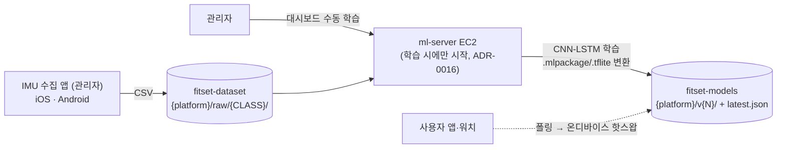
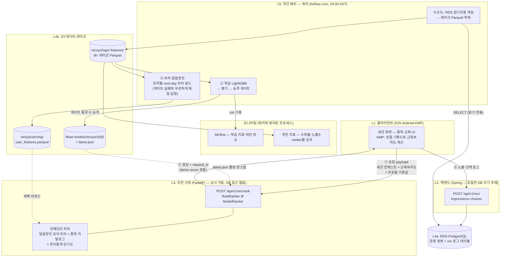

# FitSet 운동 추천 시스템 — 설계 문서 (팀 공유용 초안)

> 작성: 이주한 · 2026-07-02
> 정본 참조: [02. PRD](https://asmhangang.atlassian.net/wiki/spaces/FIT/pages/9797675) · `fitset-mcp/docs/erd/app-01-04.dbml`(ERD 정본) · `fitset-mcp/docs/epics/ml-02-mlops-dashboard/spec/architecture.md` · ADR-0005(행동 기반 종목 교체) · ADR-0013/0015/0016(MLOps 인프라)
> 코드 근거: `fitset-api-java`(Spring, 배포 중) · `fitset-ml-server`(FastAPI web/worker, 배포 중)

---

## 0. 한 줄 요약

**낮에는 로그만 쌓고, 밤에 Airflow가 학습→평가→승격을 자동으로 돌리고, 아침에 추천 서빙이 새 모델을 알아서 갈아끼운다.**
초기엔 룰베이스로 추천을 뿌리면서 노출/선택 로그를 모으고, 로그가 쌓이면 같은 API 뒤에서 LightGBM 랭커로 플래그 전환한다. 분류 모델(ml-02)의 `latest.json` 핫스왑·web/worker 분리 패턴을 그대로 확장한다.

**추론 방식**: 종목을 정답 클래스로 분류하는 게 아니라, 룰 필터로 "지금 가능한 종목"만 후보로 좁힌 뒤(200개→수십 개) 후보별 **선택될 확률**을 LightGBM predict 한 번(배치)으로 계산해 상위 3~5개를 응답한다 — 후보 생성→랭킹 2단 깔때기(대규모 추천 서비스와 같은 뼈대의 최소 구현). 종목은 출력이 아니라 입력 피처라서 종목이 늘어도 모델 구조는 불변.

---

## 1. 전체 아키텍처 — 분류 트랙과 추천 트랙은 별개 파이프라인

운동 분류(ml-01~03)와 운동 추천은 **성격이 정반대**라 파이프라인을 분리한다. 섞으면 서로의 제약(Stop/Start vs 상시 가동, 수동 학습 vs 야간 자동)이 충돌한다.

| | 운동 분류 (기존, 변경 없음) | 운동 추천 (신규) |
|---|---|---|
| 추론 위치 | **온디바이스** (워치, CoreML/TFLite) | **서버사이드** (FastAPI) |
| 재학습 | 없음 — 관리자가 대시보드에서 수동 트리거 | **야간 자동** (Airflow, 매일) |
| 학습 데이터 | 관리자가 수집한 IMU CSV | 서비스 로그 (노출/선택) |
| 모델 배포 | 앱이 latest.json 폴링 → 모델 파일 다운로드 | 서버만 교체 — 앱 무관, 앱 배포 불필요 |
| 플랫폼 분리 | ios/android 엄격 분리 (모델 2벌) | 모델 1개 (플랫폼 무관) |
| 서버 요구 | 학습 시에만 EC2 시작 (ADR-0016 Stop/Start) | **상시 가동** |
| 공유하는 것 | MLflow(실험 추적), S3 버킷 규약, latest.json 배포 패턴 — 패턴만 공유, 인프라 흐름은 독립 | |

### 1-1. 분류 트랙 (기존 — 참고용, 이번 작업에서 손대지 않음)



### 1-2. 추천 트랙 (신규 — 이 문서의 범위)

**설계 원칙 4가지:**
1. **쓰기는 Spring만** — DB 쓰기 주체는 백엔드 API 서버 하나. ML 쪽은 야간에 읽기 전용으로 긁어 데이터 레이크에 학습 형식(Parquet)으로 적재만 한다.
2. **피처 일발장전** — 야간 워커가 유저별 다음날 피처를 미리 구워 두고, 서빙은 새벽에 메모리로 로드. **낮 서빙의 DB 쿼리 = 0개.**
3. **오늘자 최신 정보는 클라가 들고 온다** — 방금 뭐 했는지(세션 컨텍스트)와 근육부하도는 요청 payload로 동봉. 일발장전 피처(어젯밤 기준) + payload(지금 기준)를 합쳐 최종 랭킹.
4. **대시보드·워커·서빙 프로세스 분리** — 학습 워커가 죽거나 바빠도 서빙·대시보드는 무관.



**흐름 요약**: 낮에는 ①②③만 돈다(서빙은 메모리+payload만 사용, DB 안 봄). 밤에는 ETL→학습→일발장전이 돌고, 새벽에 서빙이 새 피처·새 모델을 리로드한다. 야간 배치가 통째로 실패해도 낮 서빙은 **어제 피처+어제 모델로 계속 동작**한다(가용성 격리).

**분리의 실익**: 분류용 ML EC2는 ADR-0016대로 Stop/Start를 유지하고, 추천 트랙만 상시 가동 자리를 새로 정하면 된다(결정 포인트 3). 두 트랙이 공유하는 건 MLflow와 S3 규약, latest.json 배포 패턴뿐이다.

### 1-3. 학습 데이터 명세 — 피처와 정답 라벨

**학습 1행 = "한 번의 노출에서 후보 종목 1개"** (impression × 후보). 노출에 5개를 보여줬으면 5행이 생기고, 그중 선택된 1행만 라벨이 1이다.

| 그룹 | 피처 (열 = 한글 설명) | 추론 시 원천 | 학습 시 복원 원천 |
|---|---|---|---|
| 키 | `impression_id` = 어느 노출인지 · `exercise_id` = 어느 후보 종목인지 · `created_at` = 노출 시각 | — | rec_impression |
| 유저 — 프로필 | `goal` = 운동 목적(근비대/스트렝스/다이어트/체력) · `experience_level` = 온보딩 때 자가 응답한 숙련도 · `equipment` = 보유/가용 장비 목록 | payload | impression `context` 스냅샷 |
| 유저 — 이력(일발장전) | `experience_derived` = 기록으로 보정한 실제 숙련도 · `relative_strength` = 빅리프트 1RM ÷ 체중 (상대 근력) · `sessions_4w` = 최근 4주 운동 세션 수 · `user_ex_count`/`user_ex_recency` = 이 후보 종목을 몇 번, 얼마나 최근에 했는지 | 인메모리 | serving Parquet `dt=` 버전 조인 |
| 컨텍스트 — 지금 | `muscle_fatigue` = 후보 종목 주동근의 근육부하도(0~1, 낮을수록 회복됨) · `session_volume_kg` = 이번 세션 누적 볼륨(피로 수준) · `done_muscle_overlap` = 오늘 이미 한 근육군과 후보가 겹치는 정도 · `last_exercise_id` = 직전에 한 종목 · `hour_of_day`/`day_of_week` = 시각·요일 | payload | impression `context` 스냅샷 |
| 아이템 | `primary/secondary_muscles` = 후보의 주동근·보조근 · `equipment` = 필요한 장비 · `type` = 근력/유산소 구분 · `popularity` = 전체 유저 사이 인기도 | 인메모리 | 카탈로그 + global Parquet `dt=` 조인 |
| 상호작용 | `transition_freq` = "직전 종목 다음에 이 후보를 하는" 전체 유저 빈도 · `rank` = 노출 당시 몇 번째 자리였는지(위쪽이 원래 잘 클릭되는 포지션 편향 보정용) | 인메모리 / 랭커 | global Parquet / impression `items` |
| **🎯 라벨** | **`label` = 사용자가 이 후보를 실제로 골랐으면 1, 아니면 0** (DISMISS·무반응 = 전부 0) | — | **rec_impression ⋈ rec_choice** (impression_id 조인, TTL 윈도 내) |

### 1-4. 추론 시 피처 공급 — 인메모리 갱신분 vs 클라 수신분

| 공급처 | 피처 | 갱신 시점 | 없을 때 fallback |
|---|---|---|---|
| **인메모리 (새벽 1회 갱신)** | 일발장전 유저 피처(기록 기반 숙련도 보정·상대 근력·4주 활동량·종목별 수행 이력), 전역 피처("A 다음 B" 전이 통계·종목 인기도), 종목 카탈로그(근육·장비 매핑), LightGBM 모델 | 야간 배치 후 새벽 리로드 (`_SUCCESS` 마커 확인) | 유저 행 없음(가입 당일) → payload 프로필만으로 룰 랭킹 |
| **클라 payload (요청마다)** | 세션 컨텍스트(수행 종목·직전 종목·누적 볼륨), **근육부하도(KMP 계산)**, 프로필 기본값(goal·숙련도·장비), 시각·요일 | 요청 시점 — 방금 마친 세트까지 반영 | 필드 누락 → 해당 피처 중립값, 추천은 계속 동작 |

두 공급처의 역할 분담: **인메모리 = "이 유저는 어떤 사람인가"(어젯밤 기준으로 충분), payload = "이 유저는 지금 뭘 하고 있나"(초 단위 신선도 필요).** 신선도 요구와 계산 비용이 정확히 반비례하도록 배치했다.

### 1-5. 훈련-추론 정합성 (point-in-time) 판단

| 피처군 | 학습 시 복원 방법 | 판정 |
|---|---|---|
| payload류 (컨텍스트·부하도·프로필) | impression `context`에 **서빙이 실제 받은 값 그대로 박제** — 재계산 없음 | ✅ 완전 정합. 스큐 원천 차단 |
| 일발장전 유저 피처 | serving Parquet이 `dt=` 파티션 **불변 파일**이라 노출 당일 버전으로 조인 가능 | ✅ 단, 새벽 리로드 경계(03~06시 노출은 전날 파일 사용 가능성) 때문에 **날짜 추정 조인은 위험** → 아래 보완 ① |
| 전역 피처·카탈로그 | 동일 (`dt=` 버전 조인) | ✅ 동일 조건 |
| 노출 rank | impression `items`에 기록됨 | ✅ 포지션 편향 보정 가능 |
| **라벨** | choice는 impression **이후에만** 발생 — 구조상 미래 정보가 피처로 샐 수 없음 | ✅ 단, 늦은 choice의 오조인 방지 필요 → 보완 ② |

**종합 판정: 정합성 설계 성립.** 핵심 장치는 ①payload 스냅샷 박제(재계산 오차 0) ②일발장전 파일의 dt 불변 버전닝 ③라벨이 시간상 피처 뒤에만 생기는 구조. 남은 보완 2개:

- **보완 ①**: 서빙 응답에 `feature_version`(로드 중인 serving 파일의 dt)을 포함하고 앱이 노출 로그에 실어 보낸다 → 학습 조인이 "추정"이 아닌 "기록된 버전"으로 정확해짐. 컬럼 하나짜리 보험.
- **보완 ②**: 라벨 TTL — choice는 같은 세션 내(또는 노출 후 30분)만 유효 조인. 다음날 우연히 같은 종목을 한 게 ACCEPT로 잡히는 오염 방지.

---

## 2. 레이어별 설명

### L1. 클라이언트 (iOS·Android·KMP)

| 항목 | 내용 |
|---|---|
| 역할 | 추천 요청·표시, 선택/무시 피드백 전송. **오늘자 최신 컨텍스트의 정본**(오프라인 우선 설계 — 로컬에 자기 기록 보유) |
| 기술 스택 | SwiftUI / Compose, 비즈니스 로직 KMP 공유 모듈(ADR-0012·0017) |
| 해야 할 작업 | ① 종목 교체 바텀시트에 추천 섹션 추가 ② **KMP 공유 모듈에 근육부하도 계산기 구현**(로컬 최근 72h 기록 기반, 5장 공식) — iOS/Android 단일 구현 ③ 추천 요청 payload 구성 ④ 응답의 `request_id` 보관 → 노출·선택/닫기 로그를 Spring으로 전송 ⑤ 온보딩 3문항(숙련도·목적·장비) |
| payload로 보내는 것 | `session_done_exercises`, `last_exercise_id`, `session_volume_kg`, **`muscle_fatigue`(KMP 계산값)**, **프로필 기본값(goal·experience_level·equipment)** — 프로필 동봉 이유: 서빙이 DB를 안 보므로, 가입 당일(일발장전 피처 없는) 유저도 즉시 추천 가능 |
| 오프라인 처리 | 추천은 온라인 기능 — 오프라인이면 섹션 숨김(PRD "연결 후 이용 가능" 패턴). 노출/선택 로그는 기존 오프라인 큐에 실어 재연결 시 전송 |

간단 UI 스케치 (종목 교체 바텀시트 + 온보딩):

```
┌─ 종목 교체 ────────────────┐   ┌─ 온보딩 3/4 ───────────────┐
│ 레그 프레스 대신…          │   │ 운동 경험이 어느 정도인가요? │
│                            │   │  ○ 이제 시작해요 (1년 미만)  │
│ ✨ 추천                    │   │  ● 좀 해봤어요 (1~3년)      │
│ ① 핵 스쿼트     [하체·머신]│   │  ○ 오래 했어요 (3년+)       │
│ ② 불가리안 스플릿 [하체·덤벨]│   │                            │
│ ③ 레그 익스텐션  [하체·머신]│   │ 주로 쓰는 장비는? (복수)    │
│    ─ 회복된 하체 위주 추천  │   │  [바벨] [덤벨] [머신] [맨몸] │
│                            │   │  [케이블] [밴드]            │
│ 전체 종목에서 찾기 >        │   │                            │
└────────────────────────────┘   └────────────────────────────┘
  ①~③ 탭 = ACCEPT 로그          → users 컬럼 + user_equipment 저장
  시트 닫기 = DISMISS 로그
```

### L2. 백엔드 API (fitset-api-java, Spring Boot — 상시 가동 EC2)

| 항목 | 내용 |
|---|---|
| 역할 | **유일한 DB 쓰기 주체.** 로그 수집(INSERT)과 온보딩 확장 필드 저장. 추천 런타임 경로에는 로그 수집 외 관여하지 않음 |
| 기술 스택 | Spring Boot(Java)·JPA·PostgreSQL. 배포는 기존 패턴(GitHub Actions→S3 jar→SSM→EC2, OIDC) |
| 해야 할 작업 (인화님) | ① `rec_impression`/`rec_choice` 테이블 + 수집 API 2개 ② 온보딩 API에 숙련도·목적·장비 필드 추가 ③ **야간 ETL용 읽기 전용 DB 계정** 발급 (SELECT only — ML 쪽은 이 계정으로만 접근) |
| DB | 아래 4장 DDL 참조. `user_feature_daily` 테이블은 불필요해짐 — 일발장전 피처는 S3 `recsys/serving/`에 두고 서빙이 메모리 로드 (4-4 참조) |
| 쿼리 부담 | 런타임엔 로그 INSERT뿐. 읽기 부하는 전부 야간 ETL(새벽 3시, 읽기 전용 계정)로 이동 |

### L3. 추천 서빙 (fitset-ml-server 확장, FastAPI)

| 항목 | 내용 |
|---|---|
| 역할 | 후보 생성 + 랭킹 + 응답. `RuleRanker ⇄ ModelRanker` 전략 패턴으로 룰→ML 전환을 API 뒤에서 흡수 (앱·백엔드 무수정). **DB 접근 없음 — 인메모리 피처 + 요청 payload만으로 즉시 응답** |
| 기술 스택 | FastAPI(web/worker 분리 컨벤션 재사용), LightGBM(추론 CPU), 인메모리 피처(일발장전 유저 피처 + 종목 카탈로그 + 전이통계) |
| 해야 할 작업 (주한) | ① `POST /api/v1/rec/rank` 라우터 ② RuleRanker v0(6장) ③ 피처 로더 — 새벽에 S3 `recsys/serving/user_features.parquet` 리로드(+기동 시) ④ latest.json 폴링 핫스왑(분류 모델 패턴 재사용) ⑤ 응답 스키마 고정: `{request_id, feature_version, items:[{exercise_id, rank, score, reason}]}` — **score·feature_version을 응답에 포함해야 앱이 노출 로그에 실어 보낼 수 있음** (1-5 보완 ①) ⑥ 일발장전 피처가 없는 유저(가입 당일) fallback: payload 프로필만으로 룰 랭킹 |
| 메모리 산정 | 유저 피처 1행 ≈ 수백 byte × 유저 수 — 1만 유저에 수 MB 수준. Redis가 필요해지는 건 수십만 유저부터 |
| 분류 트랙과의 관계 | **런타임 완전 분리** — 분류용 ML EC2(Stop/Start)는 그대로 두고, 추천 서빙은 별도 상시 가동 자리에 배치. 코드 레포는 `fitset-ml-server` 컨벤션(web/도메인, worker/) 재사용하되 배포 단위(컨테이너·인스턴스)는 독립 |
| ⚠️ 배치 결정 필요 | 추천 서빙+Airflow의 상시 가동 자리: (a) 상시 가동 중인 **api EC2에 컨테이너 동거** ← 권장(추가 비용 0, 초기 트래픽 미미) (b) 추천 전용 소형 인스턴스 신설(t3.small ≈ 월 $15, 장애 격리) |

### L4. 데이터 레이어 (RDS + S3 레이크)

| 항목 | 내용 |
|---|---|
| 역할 | RDS = 운영 정본 + 로그 1차 수집. S3 = 데이터 레이크(학습·분석용 불변 사본) + 모델 저장소 |
| 기술 스택 | RDS PostgreSQL(ADR-0010·0016) / S3 Parquet `dt=` 파티션 / 분석 쿼리는 DuckDB(필요 시 Athena) |
| 해야 할 작업 | ① 신규 테이블 DDL 합의(4장) ② S3 경로 규약 추가: `fitset-dataset/recsys/logs/{impressions,choices}/dt=…/`, `fitset-dataset/recsys/features/`, `fitset-models/recsys/v{N}/`+`latest.json` |
| 왜 별도 DW가 없나 | S3 Parquet가 웨어하우스 역할. 데이터 이동 없이 DuckDB/Athena로 조회, 운영비 ~0 |
| ⚠️ 확인 필요 | ERD dbml 헤더는 `database_type: 'MySQL'`인데 ADR-0010과 `application.yaml`은 **PostgreSQL**. 인화님 확인 필요 (본 문서 DDL은 표준 SQL로 양쪽 호환) |

### L5. 배치·오케스트레이션 (Airflow + 학습 워커 + MLflow)

| 항목 | 내용 |
|---|---|
| 역할 | 야간 자동화 3종: **ETL**(읽기 전용→레이크) / **학습·평가·승격** / **피처 일발장전**. 워커 프로세스는 대시보드·서빙과 분리 |
| 기술 스택 | Airflow(docker-compose cron), LightGBM(LambdaRank), MLflow(기존 인스턴스 공유 — SQLite on EBS + S3 artifact), 워커는 기존 컨벤션대로 subprocess |
| DAG (매일 03:00 KST) | `etl_extract → build_train_features → train → evaluate → gate → promote` 와 **병렬로** `etl_extract → bake_serving_features → publish` — **일발장전은 승격 게이트와 독립**: 학습이 실패해도 피처는 매일 갱신돼야 함(모델만 어제 것 유지) |
| 해야 할 작업 (주한) | ① Airflow 설치·DAG 작성 ② ETL(읽기 전용 계정 → Parquet) ③ 학습 피처 빌드 — **point-in-time: impression의 context 스냅샷만 사용, 현재 테이블 재조인 금지** ④ 일발장전 태스크: 유저별 피처(숙련도 보정·relative_strength·4주 활동량·선호 종목) + 전역 데이터(전이 통계·인기도) → S3 `recsys/serving/` ⑤ evaluate: 마지막 1~2일 홀드아웃, recall@3·NDCG@3 ⑥ gate: 프로덕션 지표 이하면 승격 스킵 + 슬랙 알림 |
| 승격 실패 시 | 모델만 어제 것 유지, 피처는 정상 갱신. 승격 후 문제 시 latest.json을 이전 버전으로 되돌리면 즉시 롤백 |

### L6. 모델 배포·전환 (S3 + latest.json)

| 항목 | 내용 |
|---|---|
| 역할 | 무중단 모델 교체. 분류 모델(ml-02)과 동일 패턴이라 팀 학습 비용 0 |
| 방식 | promote가 `fitset-models/recsys/v{N}/model.txt`+`metrics.json` 업로드 → `latest.json` 갱신 → 서빙이 폴링(또는 DAG 마지막에 `POST /admin/reload`) → 메모리 교체 |
| 분류 모델과 차이 | 분류는 온디바이스(.mlpackage/.tflite, 앱이 폴링) / 추천은 **서버사이드**(서버만 폴링, 앱 배포 불필요). 플랫폼 분리(ios/android)도 추천엔 불필요 — 모델 1개 |

---

## 3. 현재 ERD (정본: `fitset-mcp/docs/erd/app-01-04.dbml`)

인화님이 오늘 완성한 정규화 ERD. 추천 관점 요약:

| 테이블 | 추천 관점 의미 |
|---|---|
| `users` | provider·onboarding_completed만 있음 — **프로필 컬럼 없음(아래 gap)** |
| `exercises` + `exercise_muscle`(role: primary/secondary) + `muscles` | 아이템 근육군 피처 (M:N 정규화) |
| `exercise_equipment` + `equipments` | 아이템 장비 피처 (M:N) |
| `workout_template` / `template_exercise` / `template_set` | 루틴(계획) — 템플릿 추천의 저장 대상 |
| `workout_log` / `log_exercise` / `log_set` | 수행 기록 — 피로도·이력·전이 통계의 원천 |
| `exercise_one_rm` (user × exercise 유니크) | **1RM 이미 설계됨** ✅ |

컨벤션: 모든 PK `char(36)` UUID, 모든 테이블 `created_at`·`updated_at`.

> 참고: 배포 중인 `fitset-api-java` 엔티티(workout_session/set_record, JSON 컬럼, users 프로필 포함, gym_profile 존재)와 새 ERD가 다르다. 새 ERD가 정본이라는 전제로 작성했고, java 엔티티에만 있는 것들(프로필 컬럼·gym_profile)이 새 ERD에서 빠진 게 의도인지 확인 필요.

### 필요 피처 대비 gap

| 필요 피처 | 새 ERD 상태 | 조치 |
|---|---|---|
| 1RM | ✅ `exercise_one_rm` | 그대로 사용 |
| 사용 가능 장비 | ❌ 유저-장비 연결 없음 | `user_equipment` 신설 (4-1) |
| 신체정보·운동 목적·숙련도 | ❌ users에 프로필 없음 | `users` 컬럼 추가 (4-2) |
| 근육 피로도 | 원천 데이터 ✅ (`log_set`×`exercise_muscle`) | 테이블 불필요 — 계산 도출 (5장) |
| 추천 노출/선택 로그 | ❌ | `rec_impression`/`rec_choice` 신설 (4-3) |
| 야간 배치 피처 | ❌ | `user_feature_daily` 신설 (4-4) |

---

## 4. DB 변경 제안 (ERD 컨벤션 준수 — char(36) PK, created_at/updated_at)

### 4-1. `user_equipment` — 보유/가용 장비 (M:N, exercise_equipment와 동형)

```sql
CREATE TABLE user_equipment (
  id           char(36) PRIMARY KEY,
  user_id      char(36) NOT NULL REFERENCES users(id),
  equipment_id char(36) NOT NULL REFERENCES equipments(id),
  created_at   timestamp NOT NULL,
  updated_at   timestamp NOT NULL,
  UNIQUE (user_id, equipment_id)
);
```

### 4-2. `users` 프로필 컬럼 (온보딩 확장과 함께)

```sql
ALTER TABLE users
  ADD COLUMN gender              varchar(10),
  ADD COLUMN birth_date          date,
  ADD COLUMN height_cm           int,
  ADD COLUMN weight_kg           decimal(5,2),
  ADD COLUMN fitness_goal        varchar(20),  -- MUSCLE_GAIN/STRENGTH/FAT_LOSS/GENERAL_FITNESS
  ADD COLUMN experience_level    varchar(20),  -- BEGINNER/INTERMEDIATE/ADVANCED (자가 응답)
  ADD COLUMN weekly_workout_days smallint;     -- 주당 운동 가능 일수 (루틴 템플릿 매칭)
```

- java 엔티티에 이미 있던 컬럼(gender~fitness_goal)의 복원 + 신규 2개(experience_level, weekly_workout_days).
- `fitness_goal`은 자유 String이 아닌 enum 값으로 표준화 제안 — 추천 룰 매칭에 필요, 데이터 쌓이기 전인 지금 굳히는 게 싸다.
- 부상/건강 상태는 민감정보(별도 동의 필요) → MVP 제외 권장.

### 4-3. 추천 로그 (핵심 — 이게 라벨이 된다)

```sql
-- 추천을 보여줄 때마다 1행. context 스냅샷 = point-in-time 누수 방지 장치
CREATE TABLE rec_impression (
  id         char(36) PRIMARY KEY,          -- request_id 겸용, 앱에 응답으로 전달
  user_id    char(36) NOT NULL REFERENCES users(id),
  surface    varchar(30) NOT NULL,          -- EXERCISE_SWAP / NEXT_EXERCISE / ROUTINE
  workout_log_id char(36),                  -- 진행 중 세션 (있으면)
  items      jsonb NOT NULL,                -- [{exercise_id, rank, score}]
  context    jsonb NOT NULL,                -- 그 시점 스냅샷 (아래 예시)
  ranker     varchar(20) NOT NULL,          -- rule_v0 / lgbm_v3 — 누가 뿌렸는지 (A/B·편향 보정용)
  created_at timestamp NOT NULL,
  updated_at timestamp NOT NULL
);
CREATE INDEX idx_rec_impression_created ON rec_impression (created_at);       -- 야간 export
CREATE INDEX idx_rec_impression_user ON rec_impression (user_id, created_at);

-- 사용자가 반응했을 때 1행
CREATE TABLE rec_choice (
  id            char(36) PRIMARY KEY,
  impression_id char(36) NOT NULL REFERENCES rec_impression(id),
  exercise_id   char(36),                   -- 선택 종목 (DISMISS면 NULL)
  action        varchar(20) NOT NULL,       -- ACCEPT / DISMISS
  created_at    timestamp NOT NULL,
  updated_at    timestamp NOT NULL
);
CREATE INDEX idx_rec_choice_impression ON rec_choice (impression_id);
```

`context` 스냅샷 예시:

```json
{
  "goal": "MUSCLE_GAIN", "experience_level": "INTERMEDIATE",
  "equipment": ["barbell", "dumbbell", "machine"],
  "session_done_exercises": ["squat", "leg-press"], "session_volume_kg": 4200,
  "muscle_fatigue": {"quads": 0.8, "chest": 0.1, "back": 0.3},
  "last_exercise_id": "leg-press", "hour_of_day": 19, "day_of_week": 4,
  "feature_version": "2026-07-02"
}
```

- 라벨: `rec_impression ⋈ rec_choice` → 노출 종목별 선택 여부(1/0). 무반응은 choice 없음 = negative.
- MySQL로 확정되면 `jsonb`→`json`만 바꾸면 됨.

### 4-4. 일발장전 피처 — DB 테이블이 아니라 S3 파일 (서빙이 메모리 로드)

서빙이 DB를 안 보므로 RDS 테이블은 만들지 않는다. 야간 워커가 S3에 굽는다:

```
fitset-dataset/recsys/serving/dt=2026-07-03/
  user_features.parquet   # 유저당 1행:
                          #   experience_derived (기록 기반 숙련도 보정값)
                          #   relative_strength  (빅리프트 1RM ÷ 체중, 상대 근력)
                          #   sessions_4w        (최근 4주 세션 수)
                          #   total_volume_kg    (총 누적 볼륨)
                          #   fav_exercises      (종목별 수행 빈도·최근성)
  global_features.parquet # 전이 통계("A 다음 B" 빈도), 종목 인기도
  _SUCCESS                # 완료 마커 — 서빙은 이 마커 확인 후 리로드
```

- 서빙 FastAPI가 새벽(+기동 시)에 로드해 dict로 보유. 1만 유저 기준 수 MB — Redis는 수십만 유저부터.
- 어젯밤 배치가 실패하면 그제 파일을 그대로 쓴다(가용성 격리). 리로드 실패는 슬랙 알림.

---

## 5. 피처 3원천 전략 — 런타임 DB 쿼리 0개

시간-범위 집계를 요청마다 DB에서 하면 쿼리 지옥이 맞다. 그래서 **서빙의 DB 접근을 아예 없앴다**:

| 원천 | 피처 | 신선도 | 획득 방법 |
|---|---|---|---|
| ① 요청 payload (클라) | 세션 내 수행 종목, 직전 종목, 세션 볼륨, **근육부하도**, 프로필 기본값 | **지금 이 순간** | 앱이 로컬 데이터로 구성 (오프라인 우선 설계 덕에 앱이 자기 기록의 정본) |
| ② 인메모리 — 일발장전 | 숙련도 보정값, relative_strength, 4주 활동량, 선호 종목 | 어젯밤 기준 | 야간 워커가 S3에 굽고 서빙이 새벽 리로드 (4-4) |
| ③ 인메모리 — 전역 | 종목 카탈로그(근육·장비), 전이 통계, 인기도 | 어젯밤 기준 | 동일 (유저 무관 전역 데이터) |

**근육부하도는 KMP 공유 모듈에서 계산한다** (iOS/Android 단일 구현 — 로직 이원화 방지):

```
근육군 m 부하도 = Σ_로컬 최근 72h 세트 [ 볼륨(weight×reps) × 기여(primary 1.0/secondary 0.5)
                                        × 감쇠 0.5^(경과h/48h) ]  → 최근 최대치로 0~1 정규화
부하도 낮음 = 회복된 부위 = "지금 필요한 부위" → 추천 가점
```

앱이 방금 마친 세트까지 반영된 **가장 신선한 값**을 계산할 수 있다 — 서버는 동기화 지연 탓에 오히려 이 값을 실시간으로 못 만든다.

- **훈련-서빙 정합성**: 서빙이 실제 사용한 값(payload 그대로 + 일발장전 피처)을 impression `context`에 박제 → 학습이 그 값을 쓴다. 재계산 오차 자체가 없음. 클라 계산값도 로그에 남으니 검증 가능.
- **가입 당일 유저**: ②에 행이 없음 → payload의 프로필 기본값만으로 룰 랭킹 fallback (L3 ⑥).
- **피처스토어(Feast) 도입 트리거**: 중량 추천·피드 추천 등 **두 번째 모델**이 같은 피처를 쓰기 시작할 때(정의 중복→skew 위험). 그때 4-4의 serving Parquet이 그대로 online store 소스로 승격된다. 지금은 안 함.

---

## 6. 룰베이스 v0 (콜드스타트 랭커)

```
후보: exercises WHERE 장비 ⊆ user_equipment
      AND (교체면) primary 근육군 겹침 AND 세션 내 수행 종목 제외
점수 = w1·개인이력 (이 종목 수행 빈도×최근성)          ← ADR-0005 "개인 이력 우선"
     + w2·전이통계 ("A 다음 B" 전역 빈도)              ← ADR-0005 "전체 집계 보완"
     + w3·회복도 (1 − muscle_fatigue[primary])
     + w4·목적적합 (goal × 종목 type 매핑 룰)
     − w5·난이도 페널티 (experience_level 대비 고난도)
```

- 루틴 추천은 ML이 아니라 콘텐츠+룰: 표준 템플릿 10~20개(풀바디/2분할/PPL × 목적)를 `experience_level × fitness_goal × weekly_workout_days`로 매칭, `workout_template`에 저장.
- 순서는 **다음 운동(교체) 추천 먼저** — 라벨(선택/무시)이 즉시 쌓이고 ADR-0005로 제품 자리가 이미 있음. 루틴 수락은 피드백이 sparse.
- 아이템 보강 데이터: `yuhonas/free-exercise-db`(800+ 종목, 오픈 라이선스) → 시드에 난이도·compound 매핑. 숙련도 구간은 스트렝스 스탠다드 참조.

---

## 7. 로드맵 & 역할 분담 (제안)

| 단계 | 내용 | 담당 | 비고 |
|---|---|---|---|
| ① 이번 주 | 로그 테이블 2개 + 수집 API + ETL용 읽기 전용 DB 계정 + users/user_equipment DDL | 인화 + 주한(스키마) | **최우선 — 이때부터 라벨이 쌓임** |
| ① 이번 주 | 온보딩 3문항(숙련도·목적·장비) + 교체 UI 추천 섹션 + **KMP 근육부하도 계산기** + payload·로그 전송 | 준형 + 주한(공식·스키마) | UI 스케치 2장 참조 |
| ② | 추천 서빙 RuleRanker v0 + 피처 로더 + 응답 스키마 고정 | 주한 | 도그푸딩으로 로그 검증 |
| ③ | 학습 스크립트 + MLflow 기록 (수동 실행 완성) | 주한 | 기존 MLflow 공유 |
| ④ | Airflow 야간 DAG + 승격 게이트 + 슬랙 알림 | 주한 | 상시 가동 자리 결정 선행(결정 포인트 3) |
| ⑤ | latest.json 핫스왑 + 룰→ML 플래그 전환 | 주한 | 베타(8~9월) 로그 쌓인 뒤 |
| ⑥ | Feast·오토스케일링 | — | 두 번째 추천 모델 나올 때 재평가 |

---

## 8. 내일 논의할 결정 포인트

1. **DB 엔진**: ERD dbml은 MySQL, ADR-0010·운영 설정은 PostgreSQL — 어느 쪽이 정본? (본 문서 DDL은 양쪽 호환)
2. **users 프로필 컬럼**: java 엔티티에 있던 프로필이 새 ERD에서 빠진 게 의도인지 → 4-2안으로 복원+확장 제안
3. **추천 서빙+Airflow의 상시 가동 자리**: api EC2 컨테이너 동거(권장, 비용 0) vs 전용 소형 인스턴스(장애 격리). 분류용 ML EC2는 ADR-0016 Stop/Start 그대로 유지 — 트랙 분리로 충돌 해소
4. **근육부하도 클라 계산 합의**: KMP 공유 모듈에 계산기 구현(준형님 작업 필요). 멀티기기 사용 시 로컬 기록 불완전 가능성은 추천 특성상 허용 가능한 오차로 간주
5. **fitness_goal enum 표준화** 4종으로 확정
6. **온보딩 3문항 추가** — PRD상 온보딩 확장은 MVP 이후 범위였음 → 추천 위해 앞당기는 합의 필요

## 부록. 팀 설명용 Q&A

- **왜 DW를 안 만들어요?** → S3 Parquet가 곧 웨어하우스. DuckDB/Athena로 데이터 이동 없이 조회, 운영비 ~0.
- **왜 로그를 DB에 먼저 쌓아요?** → Spring INSERT 하나로 끝. 스트리밍(Kafka/Kinesis)은 트래픽이 정당화할 때.
- **쿼리 지옥 아니에요?** → 5장. 무거운 집계는 전부 야간 배치로 밀고(일발장전), 실시간 값은 클라가 payload로 가져옴. **서빙의 런타임 DB 쿼리 = 0개.**
- **피처스토어는요?** → 피처스토어는 신선함이 아니라 규모·모델 수가 정당화하는 도구. 실시간성은 운영 DB 직접 계산이 가장 신선함. 도입 트리거는 두 번째 모델.
- **모델이 나빠지면?** → 야간 게이트가 승격 자체를 막음. 승격 후 문제면 latest.json 롤백으로 즉시 복구.
- **정답 데이터는 어디서?** → 없고, 필요 없음. 사용자의 선택(rec_choice)이 라벨. 그래서 로그 테이블이 1순위.
- **유튜브 스크립트는?** → 학습 데이터가 아니라 LLM 코칭 멘트/루틴 설명의 RAG 재료로.
